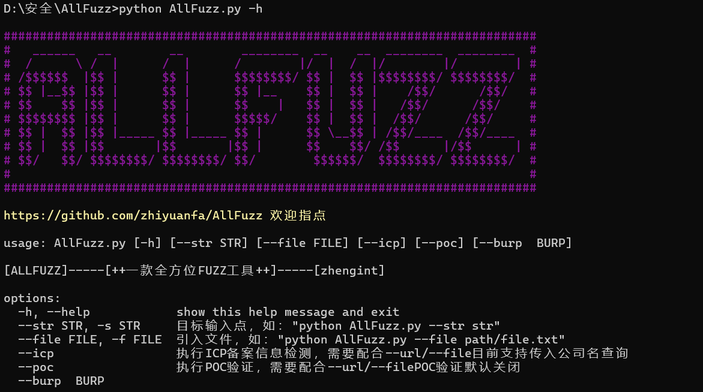

一款开箱即用的由Python编写的Fuzz工具

目前实现功能：
  基于YAML文件的批量POC验证工具
  基于公司名字的ICP查询并对查询到的网址执行POC批量验证
  基于目标公司名称、域名、url的扫描

使用方法：
  单个目标的poc验证：python AllFuzz.py --str targe --poc

  多个目标的poc验证：python AllFuzz.py --file targe.txt --poc
  
  扫描后进入log目录查看日志信息
  其中log.txt存放验证成功的poc和url，errorlog.txt存放错误信息，一般为poc或者目标存放文件的格式问题

局限性：
  只能接受YAML文件，且匹配的规则只有method、headers、path、body、expression
  ICP查询没有涉及到基于URL的ICP查询

未来：
  添加子域名爆破、目录扫描、POC批量验证、端口扫描、指纹识别等功能

项目主要结构：
  brute：存放爆破字典
  globals：存放全局变量、函数
  log：存放程序运行日志
  module：程序功能模块
  pocs：存放poc
  test：测试使用目录，用于存放测试用的poc
  venv：依赖库
  AllFuzz.py：程序主函数
  requirements.txt：记载程序所需要的库