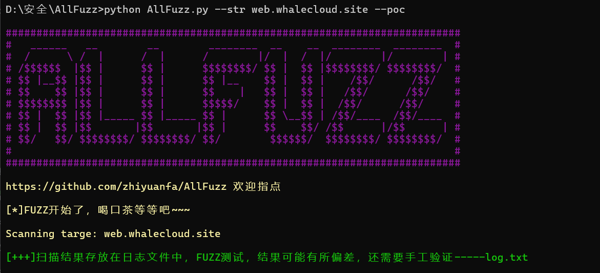
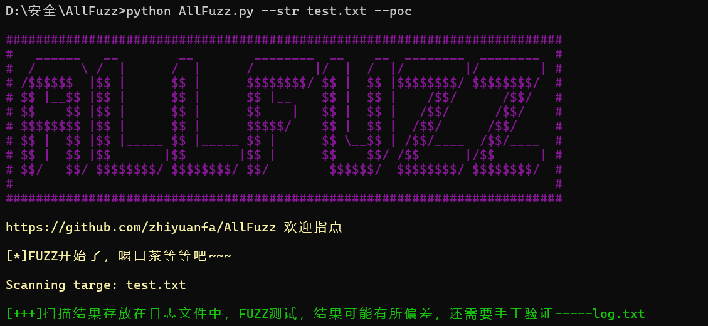
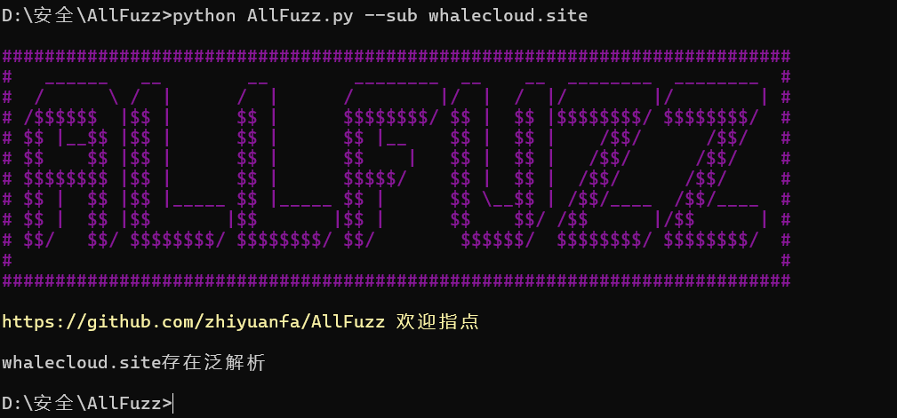

## ALLFuzz

#### git获取项目

```
  git clone https://github.com/zhiyuanfa/ALLFuzz.git
```

#### 使用参数

| 参数 | 类型     | 描述                |
| :-------- | :------- | :------------------------- |
| `--url` | `str` | `添加targe` |
|`--file`|`str`|`添加targe文件`|
|`--icp`|`none`|`对targe进行icp验证，需要有targe`|
|`--poc`|`none`|`对targe进行poc验证，需要有targe`|
|`--sub`|`str`|`对targe进行子域名爆破，需要传入targe`|
|`--time`|`int`|`时间参数，用来调整延迟时间，默认为5`|

#### 项目使用

```
  单个目标的poc验证：python AllFuzz.py --str targe --poc
```
  
```
  多个目标的poc验证：python AllFuzz.py --file targe.txt --poc
```
  
```
  扫描后进入log目录查看日志信息
  其中log.txt存放验证成功的poc和url，errorlog.txt存放错误信息，一般为poc或者目标存放文件的格式问题
  子域名爆破：python AllFuzz.py --sub targe
```
  

#### 局限性
```
POC只能接受YAML文件，且匹配的规则只有method、headers、path、body、expression
ICP查询没有涉及到基于URL的ICP查询
```

#### 未来
```
添加fofa、360资产收集、目录扫描、POC批量验证、端口扫描、指纹识别等功能
```

#### 项目主要结构
```
brute：存放爆破字典
  globals：存放全局变量、函数
  log：存放程序运行日志
  module：程序功能模块
  pocs：存放poc
  test：测试使用目录，用于存放测试用的poc
  venv：依赖库
  AllFuzz.py：程序主函数
  requirements.txt：记载程序所需要的库
```
